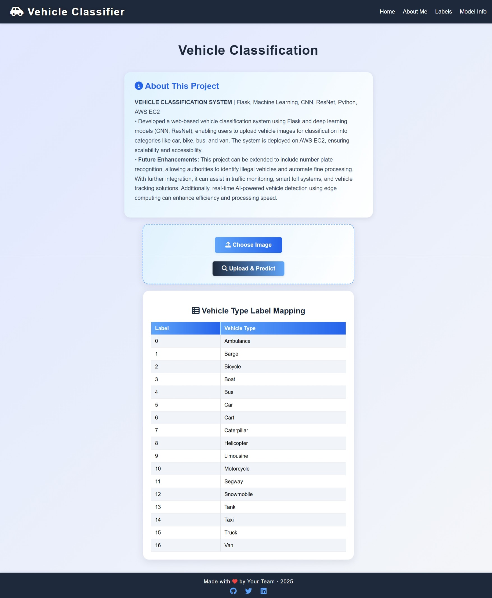
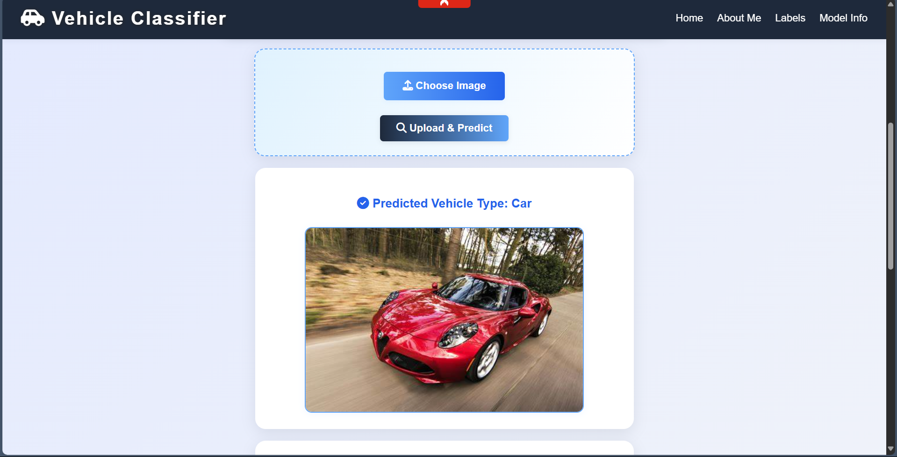

# Vehicle Classification System

A modern, web-based vehicle classification system using Flask and deep learning (Vision Transformer, CNN, ResNet). Users can upload vehicle images for instant classification into categories like car, bike, bus, van, and more. The system is designed for scalability and is ready for cloud deployment.

## Features
- Upload vehicle images and get instant AI-powered classification
- Deep learning models: Vision Transformer (ViT), CNN, ResNet
- Modern, responsive web interface (Flask, HTML/CSS/JS)
- Image preview after upload and after prediction
- Secure image storage
- Deployed on AWS EC2 (cloud-ready)
- Easily extendable for number plate recognition, traffic monitoring, smart toll, and real-time edge AI

## Tech Stack
- Python, Flask
- PyTorch, Hugging Face Transformers
- HTML, CSS, JavaScript (responsive, mobile-friendly)
- AWS EC2 (deployment)

## How to Run
1. **Clone the repository:**
   ```bash
   git clone https://github.com/NandaTadepalli/Vehicle-classification-.git
   cd Vehicle-classification-
   ```
2. **Install dependencies:**
   ```bash
   pip install -r requirements.txt
   ```
3. **Run the app:**
   ```bash
   python app.py
   ```
4. **Open your browser:**
   Visit [http://localhost:8080](http://localhost:8080) to use the app.

## Project Structure
```
├── app.py
├── main_code.py
├── requirements.txt
├── static/
│   └── uploads/
├── templates/
│   ├── index.html
│   ├── about.html
│   └── model-info.html
└── results/
    └── checkpoint-294/ (model files)
```

## Screenshots

**After Prediction:**

## Authors
Tadepalli Nanda  
[GitHub](https://github.com/NandaTadepalli) | [Portfolio](https://nandatadepalli.github.io/Portfolio2.0) | [LinkedIn](https://linkedin.com/in/nanda-tadepalli)
Munnangi Mahidhar Reddy
[GitHub](https://github.com/mahireddy05) | [LinkedIn](https://www.linkedin.com/in/munnangimahidharreddy/)

## License
This project is licensed under the MIT License.
